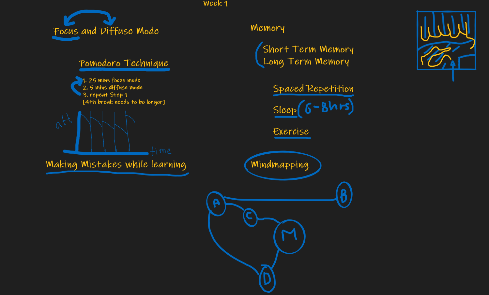
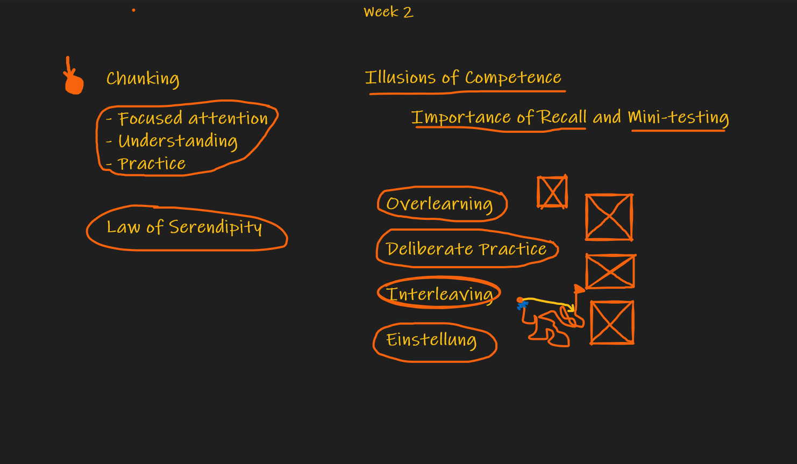

# Productivity

## Learning How To Learn Course

Link to Course: https://www.coursera.org/learn/learning-how-to-learn Link to my hand notes: https://github.com/msi1427/msikb/blob/main/hand_notes/productivity/learn_how.pdf 

### Week 1 Scribblings

### Week 2 Scribblings

### Video Walkthrough

**Week 1 and 2 walkthrough:** https://www.youtube.com/watch?v=9RUTdz46sJ0 